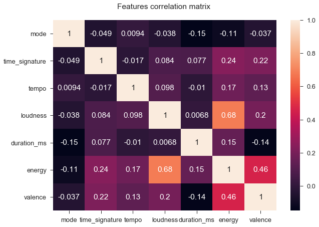
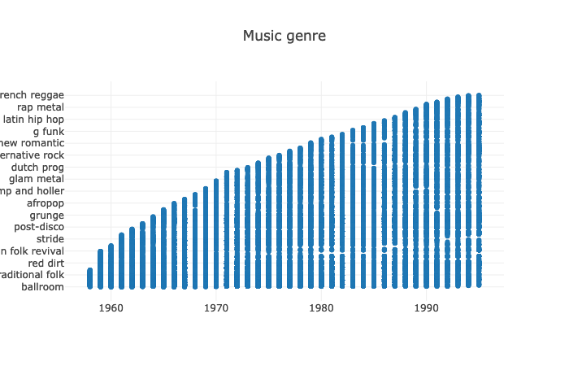
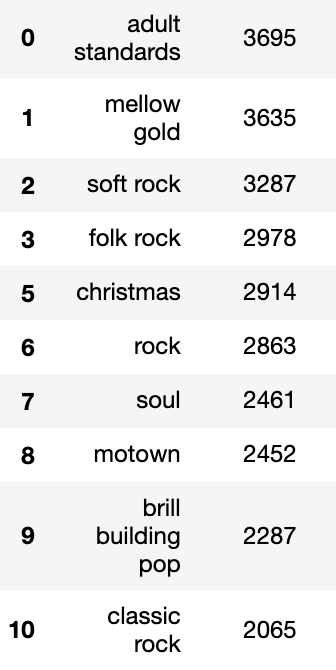

### Digital Musicology
# Understanding the impact of the Cold War on Billboard Charts:  _When the American society reflects on music creation_

### Introduction
The Cold War period, whose studied years for this project are from 1958 to 1995, saw the rise of many major and diverse cultural movements. This flourishing time also enabled an important increase in the diversity of musical genres. Regarding these prompt changes and the socio-econo-political climate, we would like to understand how major genres evolved over time and try to determine, in a second phase of the project, the possible correlations with corresponding important events. In order to conduct the research, we worked with the Billboard Charts that weekly provides the top 100 listened musics in the United States.

### Research Question and Hypothesis
Regarding our main research question, which is to understand the evolution of music from 1958 to 1995 and how it might have been impacted by contemporary events, we developed three main hypothesis that will have to be validated or invalidated throughout the conduct of the project:
1. Based on the 6 following selected features, we expect to see significant variations in a set of major genres:
    * **key**: no specific hypothesis was determined regarding this feature.
    * **loudness**: it corresponds to the overall loudness of a track in decibels (dB). A hypothesis would be to have an increase of loudness in rock-related genres musics.
    * **duration_ms**: our hypothesis is that the duration of musics tend to be shorter, regarding the growing stressful context.
    * **time_signature**: our hypothesis is that, regarding the experimental artistic context, some new time signatures might arise, however there should be an important convergence to a 4:4 time signature.
    * **tempo**: the major hypothesis regarding this aspect it that musics tend to have a faster tempo, regarding the stressful context of their productions
    * **mode**: according to what has been presented in class, we expect an increasing equilibrium between the repartition of major and minor modalities within musics.
The two major hypothesis regarding these features are that music will tend to be shorter, and tempo faster (according to literature, an increase up to 120-125 beats per minute).
2. In general, we also expect to see divergent developments between the different genres. According to the increasing diversity of genres, we assume that the difference for the above features in-between similar genres, such as all the pop variety, is minimal.

The second part of the main research question is about how can the changes observed in the different musical genres be linked to the historical context. What is the plausibility of these relationships? Which human groups are most affected by these events and which genres are related to them?

3. With regard to this aspect of the question, we seek to observe significant changes related to the African American civil rights movement, which could be expressed e.g. in the soul genre. We also expect significant historic musical events related to the counterculture movement, such as Woodstock Musical Festival in 1969, to impact music at a long-term, especially rock and folk.

### Data description

#### Data gathering and description of the dataset
The research is based on two datasets. The first dataset is composed of the Billboard weekly list (Billboard Top 100), between  1955 and 2017, found on the online platform [Kaggle](https://www.kaggle.com/), in csv format. This table contains 300'600 rows and eight columns, containing respectively the date of the week, the rank, the song title, the artist name, the number of weeks on charts, the music's year of release, the track's popularity on Spotify and the artist popularity on Spotify. The rows between 1955 and 1958 are duplicated and low-quality data. By a brief visual evaluation of the data, it can be seen that the data concerning the Spotify database are mostly missing. The number of weeks on charts is also often false or missing.

Based on song titles and artist names from this first dataset, a query is made to the [Spotify API](https://developer.spotify.com/documentation/web-api/quick-start/) in order to retrieve the corresponding entry in the Spotify database. This requires registering with Spotify as a developer and obtaining a token to access the database. The API returns json-formatted answers. The completion of the dataset is then done in several steps. The first step is to find the corresponding identifier of each track in the Spotify database, based on the artist's name and the song title. During this first run, 69% of matches were found. In a second step, this rate is increased to 78% by isolating the artist's main name and the main content of the title and thus submitting a simplified request to the API.

Then, the identifier obtained for each track allows access to the track features contained in the database (danceability, energy, key, loudness, mode, speechiness, acousticness, instrumentalness, liveness, valence, duration_ms, time_signature). After that, the track audio features (tempo, mode) are also collected in a third query. Finally, a fourth query gather the musical genre of the artist of the song.

#### Preprocessing
Data from multiple queries were merged into a single dataset. Subsequently, the billboard data was aggregated with the API data to obtain a working dataset containing: the titles of the two databases (Billboard and Spotify), the artist name of the two databases (Billboard and Spotify), the identifier in the Spotify database, the tracks features and audio features, a vector of the dates of each week when the track was present in the billboard chart, and a vector including the successive ranks in the billboard chart. Finally, the highest rank in the ranking is also recovered and stored. The column containing the number of weeks spent on the chart, which was of poor quality, as indicated above, was removed. For reasons of data density and quality, data prior to the week of 8 August 1958 are not retained. This data is stored in json format, which unlike csv is able to deal the vector type.

The data have two biases. The first is the fact that "only" 78% of them could be retrieved from the Spotify database. However, this seems relatively acceptable bias, all the more so if we adopt the standpoint that the music that are still available today and that have been digitized are the most representative of their period. Moreover, in the corpus finally selected, this percentage reach 91%. The second bias is related to the margin of error of Echonest algorithms when determining features.

#### Corpus selection
For reasons of data density and to be limited to the historical period covered by the research, only the rankings published between 8 August 1958 and 31 December 1995 have been kept in the corpus. The period extends after the end of the Cold War in order to see if changes in political situation may have influenced the music creation.

#### Features
To address the research hypotheses, we started by selecting the variables. When the algorithm to calculate a certain variable was unknown and the definition of this variable was not commonly accepted by the majority of the scientific community, we decided not to keep it for our research. Therefore, we decided to retain only six physical variables : the duration, the time signature, the tempo, the mode, the key, and the loudness, as well as two perceptual variables (i.e. issued from psychological inquiry and then extended with a machine learning algorithm) : the energy and the valence.

#### Description of the corpus
Finally, the corpus contains a total of 19,098 pieces of music representing 177,700 Billboard entries out of the 195,100 published over this period, i.e. 91%.

As we can see, most features are staying less that 20 weeks on chart, with a maximum at 42.

Hereover, a table containing the continuous features' statistics.

Finally, a plot displaying the distribution of the songs per key. Concerning the modality, 58% of the entries are classified as major, 18% as minor and 24% are not classified. For the time signature, 70% of the data are 4/4, 6% are 3/4, 0.6% are considered other (5:4 or 1:4) and 23.4% are not classified.

In this plot, one can observe the first occurence of the songs per year. As the years go by, the number of unique songs entering in the top 100 diminishes. The lower value for 1958 is due to the fact that our corpus begins the week of August 8.

One can observe that the physical variables (mode, time_signature, tempo, loudness, and duration) are only weakly correlated. The perceptual variables (energy and valence) are correlated with each other and to some of the physical variables. This is not surprising since both are covering similar perceptions of music. Energy explains the subject's perceptual sense of energy, while valence quantifies the subject's perceived positive feeling of the music. Therefore, the important correlation of energy with loudness is also intuitively expected. An interesting correlation to note is also that of energy and valence with time signature.

#### Musical genres
Regarding the different music genres proposed by the database, we can see the important increase of their numbers throughout the studied period :

In total, there are 987 different musical genres and 4961 songs do not have a given genre (either empty or nan value). Following is an excerpt of the first mostly assigned names.

Due to the important amount of different genres, it will be tried to group them into more global categories when possible. It is also important to understand the main genres listed above, such as '**adult standards**' that does not seem to be a genre but rather a category grouping musics that might be more attractive to an older audience (50 years old and above). Same applies with the '**christmas**' category, which might group songs with various musical genres. '**motown**' is also a specific case, since it is the name of an American record label. Hence, decisions will have to be made regarding these categories and whether or not they will be taken into account when working on music genres. The case of the '**mellow gold**' genre, which seems to have been invented by Spotify to group classic rock of the ‘60s, ‘70s, and ‘80s, will also requires our attention, since it is not a conventional genre in the musical field.

Bellow is a primary grouping convention into more general categories:
* **Pop**: [New wave pop, Brill building pop, Bubblegum pop, adult standards, ....]
* **Rock**: [soft rock, album rock, folk rock, classic rock, rock and roll]
* **Country**: [country rock, country, country gospel]
* **Reggae**
* **Disco**: [disco, post-disco, funk]
 * **Electro**
* **Soul**: [classic soul, southern soul, quiet storm, northern soul, Chicago soul]
* **R&B**: [urban contemporary]
* **Metal**: [ hard rock, psychedelic rock, grunge]
* **Blues**: [British blues]
* **Jazz**: [jazz funk, vocal jazz, classic jazz]
* **Folk**

### Methods
The first part of the methodology will be based on a visual graphical approach, aimed at establishing observations related to the different genres. The method will work on a weekly granularity and identification of statistically significant changes relative to a 95% confidence interval. The calculation of partial temporal derivatives, carried out over periods of variable granularity, will allow one to observe trends, of varying degrees of slowness depending on the granularity. In order to gain insights on the relative changes from one genre to another, and to better visualize the specific drift of each genre, a degree two Principal Component Analysis will be used.

### Literature
- Karen A. Cerula, "Social Disruption and Its Effects on Music: An Empirical Analysis", _Social Forces_, Vol. 62, Issue 4, June 1984, pp. 885-904, [Accessed on: <a href= https://doi.org/10.1093/sf/62.4.885> https://doi.org/10.1093/sf/62.4.885</a>]
- Richard A. Peterson and David G. Berger, "Cycles in Symbol Production: The Case of Popular Music", _American Sociological Review_, Vol. 40, No. 2, April 1975, pp. 158-173,  [Accessed on: <a href= https://www.jstor.org/stable/2094343> https://www.jstor.org/stable/2094343</a>]
-  Eric Clarke, Nicholas Cook, "Empirical Musicology: Aims, Methods, Prospects", Oxford University Press, 2004
- Timorhty J. Dowd, "Production perspectives in the sociology of music", _Poetics_, Vol. 32, Issue 3-4, pp. 235-246,  [Accessed on: <a href= https://doi.org/10.1016/j.poetic.2004.05.005> https://doi.org/10.1016/j.poetic.2004.05.005</a>]
- Peter J. Schmelz, "Introduction: Music in the Cold War", _The Journal of Musicology_, Vol. 26, No. 1, 2009, pp. 3-16 [Accessed on: <a href= https://www.jstor.org/stable/10.1525/jm.2009.26.1.3> https://www.jstor.org/stable/10.1525/jm.2009.26.1.3</a>]
- Matthias Mauch, Robert M. MacCallum, Mark Levy, and Armand M. Leroi, "The Evolution of Popular Music: USA 1960-2010", _Royal Society Open Science_, Vol. 2, No. 5, May 2015, [Accessed on: <a href= https://doi.org/10.1098/rsos.150081> https://doi.org/10.1098/rsos.150081</a>]

It seems that a great work was conducted during the 70s and 80s in order to understand the social significance of music and its relationship to sociological events. Indeed, the Cold War saw the emergence of major popular cultural movements and many artistic fields, starting by art historians, were trying to understand the impact and influences of the political situation. More recently, in 2006, the <a href= http://ams-net.org/cwmsg/>AMS Cold War and Music Study Group</a> was created by the American Musicological Society in order to understand the impact of this important event on the field. However, most of these empirical studies were focusing on lyrics and genre of musics, the predominance of certain musicians on the market and the impact of leading recording companies in the music industry. It seems that no direct analysis of the technical music properties, such as harmony, keys or tempo, and their evolutions through the years was put in relationship to these sociological context. The idea would be to go as well from the performing social context to the music generated, but to determine the structural impact rather than the style or genre evolutions.
