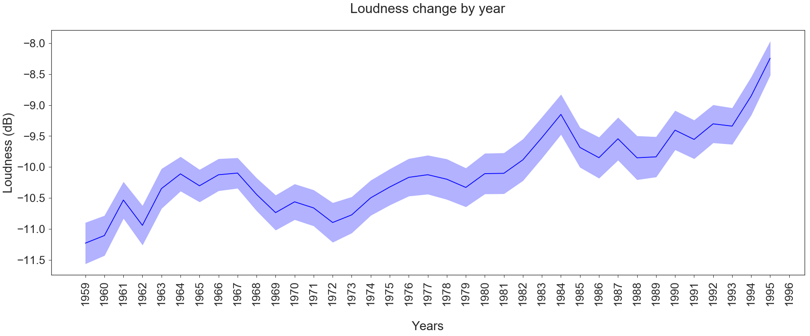
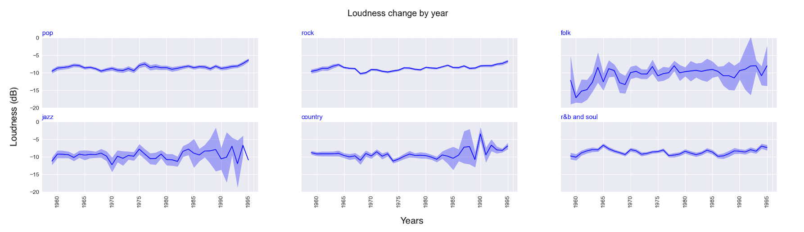
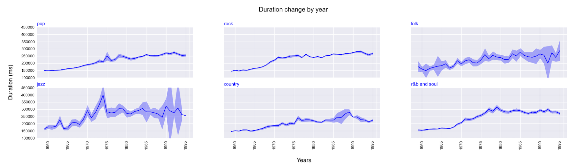
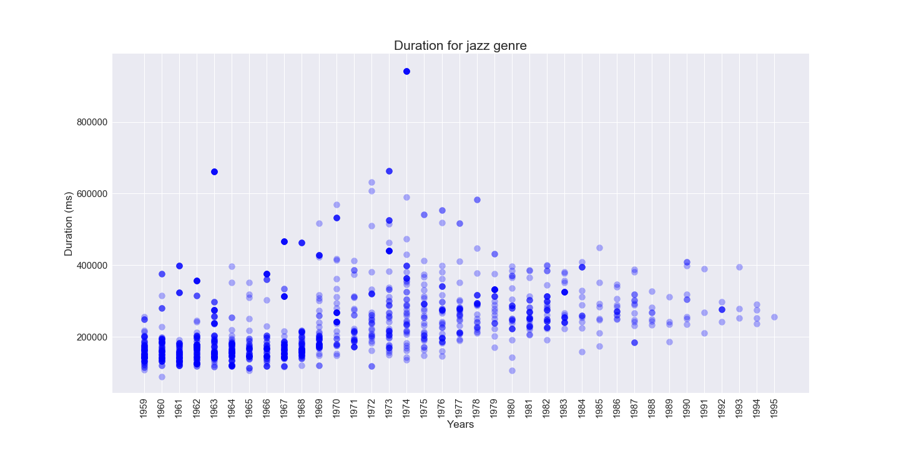
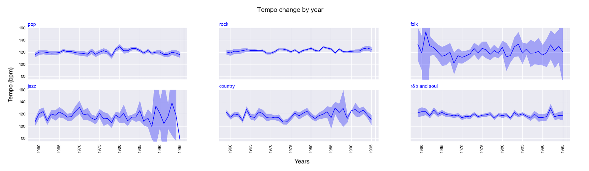
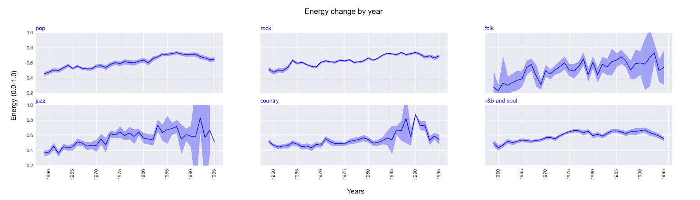
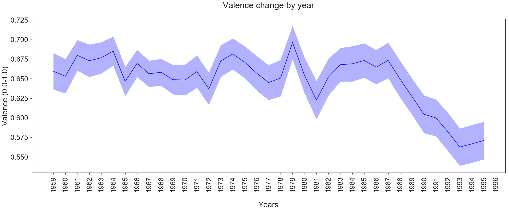
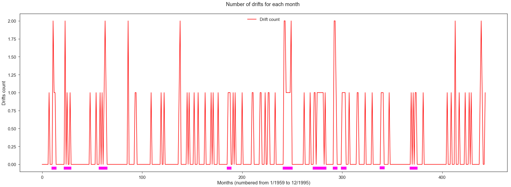
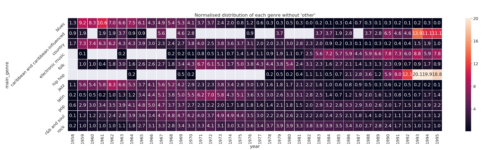

### Digital Musicology
# Understanding the impact of the Cold War on Billboard Charts:  _When the American society reflects on music creation_

## Introduction
The Cold War period, whose years from 1959 to 1995 will be analysed in the present project, saw the rise of many major and diverse cultural movements. This flourishing time also enabled a large increase in the number of musical genres. Regarding these prompt changes and the socio-economico-political climate, we will try to analyse how music changed during that period by focusing more specifically on the Billboard Charts that provides the weekly top 100 listened musical pieces in the United States, based on sales and radio play.

## Research question and hypothesis

The main research question concerns the way music changed from 1959 to 1995 and how this evolution was impacted by historical and social context.

### Hypothesis
First, we seek to observe significant changes related to specific historical events, such as the African American civil rights movement or the Woodstock Musical Festival. Those changes are expected to affect certain social groups through certain musical genres.
Second, we also expect to see divergent developments between the different genres.
    
Third we defined a number of hypothesis on specific features. Our hypothesis would be to see an increase of loudness in rock-related musical pieces. A shortening trend is expected with regard to the duration of musical pieces. Regarding time signature, the hypothesis is that, regarding the experimental artistic contexts, some new time signatures might arise. However there should be a high convergence to a 4/4 time signature. Our major hypothesis regarding the tempo aspect is that musical pieces tend to have a faster tempo, regarding the stressful context for the American civil society (according to literature, an increase up to 120-125 beats per minute). Finally, we expect an increasing equilibrium between the repartition of major and minor modalities within musical pieces.

### Assumptions
Many genres can be classified as subparts of the major genres, e.g. bubble gum pop is a subcategory of the pop genre. Knowing this, we assume that the difference for the chosen features is minimal between genres belonging to the same major genre.

Another big assumption is linked to the perceptual variables. The calibration of the energy and valence of a music was performed in the 2010s, whereas the period studied begins in 1959. Therefore, we assume that the perception of music in the Western world has changed little during these 50 years.

The third assumption considers that the margin of error of the Spotify algorithm for variable extraction is reasonable. 

## Dataset
The research is based on the Kaggle Billboard Top 100 dataset, composed of the Billboard weekly list, between 1955 and 2017. This table is composed of 300'600 rows and eight columns, containing respectively the date of the week, the rank, the song title, the artist name, the number of weeks on charts, the musical piece's year of release, the track's popularity on Spotify and the artist popularity on Spotify. For the present study, only data contained between January 1959 and December 1995 were kept. 

The musical features are retrieved by querying the Billboard songs in the  Spotify API. The proportion of the Billboard Top 100 which could be retrieved in the Spotify database reaches 94.6\%. Only six physical variables were retained from the Spotify database: the duration, the time signature, the tempo, the mode, the key, and the loudness, as well as two perceptual variables: the energy and the valence. Energy is described as a perceptual measure of intensity and activity. Valence is described as a measure of positive mood conveyed by a track. The artist's genres were also extracted from the Spotify database.

Finally, the corpus contains a total of 19,098 pieces of music representing 177,700 Billboard entries over this period. Most musical pieces are staying less that 20 weeks on chart, with a maximum lifespan of 42. In total, there are 987 different musical subgenres. Surprisingly (see figure below), as the years go by, the number of unique songs entering the top 100 diminishes drastically. After a peak at more than 550 different songs in 1967, it shrinks to only 260 in 1995.

The physical features are all independent and non-correlated. In the contrary, the perceptual features are correlated with each other, as well as with tempo, loudness, time signature and duration.

## Initial Analysis

### Methodology 

#### 1. Features evolution
To observe the evolution of the different features over time, annual granularity is preferred, as it allows to observe trends clearly and limit noise. The 95% confidence interval is also represented, so that trends can be visually identified. Categorical variables are represented according to their share in the total number of observations. 

In a second step, the salient peaks are mathematically identified and extracted. To detect salient peaks, the annual evolution of each feature is smoothed by convolution with a 5-year uniform smoothing filter f. 

  

A symmetric 2-year replication padding is carried out to avoid shrinking. The replication padding simply consists of replicating the values of the first year to the two years before the start of the data, respectively replicating the values of the last year to the two years after the end of the data. Then, the 95% interval of the representation of this smoothed annual evolution is calculated. The lower and upper bounds of this range contain non-salient observations of the distribution, while observations outside are considered salient. This procedure allows to highlight salient peaks beyond the medium-term evolution of the music, the latter being already visible in the other graphs. To also include the variations of the categorical variables, the latter are represented as integers. Finally, the salient peaks of the different features are gathered in a single list to represent and observe the concomitant salient peaks. 

#### 2. Musical genres
Due to the large amount of different genres, we decided to group them into more global categories. This was done based on the categorisation provided by the online database AllMusic and made easily retrievable by Wikipedia on their webpage <a href="https://en.wikipedia.org/wiki/List_of_music_styles"> List of music styles </a>. Hence, the content of the html page was extracted in order to list all genres and their corresponding subgenres into a json file <a href="https://github.com/ValentineCmoi/digital_musicology/blob/master/json/music_genres_classification.json"> music_genre_classification</a>. It was then used to assign for each subgenre of each song a main genre. When no corresponding main genre could be found, the name 'other' was attributed. Regarding this 'other' entry, it is important to understand that some genres, such as main genres that corresponds to '**adult standards**', '**christmas**', '**motown**', '**mellow gold**' are not genres per se but rather categories that can group many different genres. For instance, '**adult standards**' groups musical pieces that might be more attractive to an older audience (50 years old and above). Same applies to the '**christmas**' category, which groups songs that refer to Christmas, as well as the '**mellow gold**', which seems to have been invented by Spotify to group classic rock of the ‘60s, ‘70s, and ‘80s.

### Results

#### 1. Features evolution
##### 1.1 Global changes

###### 1.1.1 Root change

One can see a dominance of the C and G tonics throughout the studied time range. However, C seems to slowly decreases in the early 90s, in favor of the C#. Others dominant roots that seem to grow over the years and compete with the two firsts in the late 70s and early 80 are D and A. The use of other roots is rather constant, with a slight increase in the use of F# in the mid 90s, whereas D# seems to vanish a bit from common usage at that same time. 

###### 1.1.2 Time signature

In terms of time signature, it is important to acknowledge that, according to Spotify, the data represents "an estimaged overall time signature of a track. [...] The time signature ranges from 3 to 7 indicating time signatures of "3/4", to "7/4""<a href="https://developer.spotify.com/documentation/web-api/reference/tracks/get-audio-analysis/">2018, Spotify</a>. The presence of a time signature of 1/4 is therefore an unexpected intruder and possible explanations are discussed below. However one should note the largely leading use of 4/4 during the studied period, which even seems to expand at the expense of the other time signatures. Hence, the 5/4 time signature seems to vanish. The 3/4 time, which was still benefiting from a better share in the 60s, slowly decreases and seems to reach its lower peak around the mid 80s.

###### 1.1.3 Mode

Throughout the studied period, one can see a leading majority in the use of major modes. However, the use of minor modes slowly increases over the years and benefits from a better percentage share at the end of the given time range, going from less than 20% of use in 1959 to almost 40% in 1995.

###### 1.1.4 Loudness

The first graph clearly shows a significant augmentation of the overall loudness in musical pieces. Relatively to the range of values that this feature can take, namely from -60dB to 0dB, it might not seem such a big increase, as it goes from -11,5dB to -8dB. However, one should recall that the dB scale is logarithmic. The increase was bigger from 1972 to 1984, and after 1993.

For the second graph, only six genres (pop, rock, folk, jazz, country, and r&b and soul) are plot because they are the ones with enough data to be meaningful This graph shows that there are almost no changes in loudness for the pop, rock, and R&B and soul genres. In folk genre, there is an increase in loudness during the 60s, but the sample is not big enough to confirm this trend. For jazz and country genre, there is a small increase since the mid 80s, but as before, that trend cannot be confirmed, especially for jazz.

The third graph shows three major events where a positive change appears in comparison to the general trend of the loudness. The first two peaks occur from March to April 1977 and from January to April and August 1984. The last peak takes place during August, September and December of 1995, but as it occurs at the end of the graph, it might not be relevant as it could be considered as an effect of the way the padding was made to compute salient peaks.

###### 1.1.5 Duration

The first graph clearly shows an increase of the duration of musical pieces through time. From 1959 to 1964, the increase is really small. However from 1964 and until 1979, there is a significant increase of duration of music pieces as it goes from 1550000 ms (around 2,5 minutes) to 265000 ms (more than 4,5 minutes). After that, there is a small decrease where the duration is closer to 240000 ms (4 minutes), followed by a small increase that leads again to a duration of about 4,5 minutes.

The second graph shows that almost all genres, with the exception of jazz, have an increase of duration that is similar to the one observed in the first graph. Nevertheless, there is a decrease in country that does not appear in any other genres. Jazz has a big increase of duration from 1959 until 1974, followed by a decrease in 1975 and a stabilisation of the duration until the end of the observed period.

The third graph shows that two major events have happened. The first one occurred during the months of January and March to May 1964, where there is a negative change in comparison to the general trend, which was more increasing when here there is a decrease of duration. The second one is from February to March 1990, where there is a positive change in comparison to the general trend. There is a possibly of a third peak in 1995, but as the graph ends in 1996, it might probably be a padding effect.

###### 1.1.6 Tempo

The first graph shows that there is no real change in tempo through the years, the changes that appear are not significant. The second graph shows that for each genre there is no real change in tempo through the years. It is really flat for pop, rock and r&b and soul genres. No major event can be observed in the tempo salient peaks figure.

###### 1.1.7 Energy

The energy tends to rise slowly during the whole period, in four consequent steps. A first major step occurs between 1962 and 1964. The second step, in 1970, appears to be driven by a salient event from June to July 1970. The third step takes place between 1973 and 1974 and the fourth and last step occurs between 1982 and 1984 and is preceded by a low-bound event which begins in September 1981 and ends in January 1982.

###### 1.1.8 Valence

The valence seems to be relatively stable until 1987. It falls significantly and durably at the end of the Cold War. This decrease is progressive rather than sudden but still consequent. 

One can observe four major events in the valence salient peaks figure. The first occurs from July to August 1976, the second from November to December 1977, the third spread from March to August 1979 and the last event takes places between September 1981 to January 1982. These events occur in the form of up-and-down cyclic events. The two last peaks are clearly visible also at year granularity. 

###### 1.1.9 Statistical significance
To show the order of magnitude of the statistical significance in relation to these plots representing the 95% confidence interval, a bootstrapped two-sample test (Welsch) has been performed on the data. The null-hypothesis is that both samples have equal means and it was rejected in every test performed. It shows that visual analysis using the figures is more than sufficient to establish the correlation, thanks to the very large amount of data.

| Feature                     | Sample 1  | Sample 2  | P-value  |
|-----------------------------|-----------|-----------|----------|
| loudness                    | 1959-1977 | 1978-1995 | 1e-51    |
| time signature (4/4 vs 3/4) | 1959-1974 | 1975-1995 | 5e-84    |
| mode                        | 1959-1970 | 1983-1995 | 3e-86    |
| duration                    | 1959-1965 | 1974-1995 | < 1e-200 |
| energy                      | 1959-1970 | 1983-1995 | < 1e-200 |
| valence                     | 1959-1986 | 1990-1995 | 3e-25    |

##### 1.2 Salient peaks

This graph represents the sum of the salient peaks, i.e. the projection of all salient peaks in a single plot, month by month, for each of the eight features. Denser regions represent periods when many salient peaks have occurred concurrently, while higher peaks represent a cross-sectional impact on several features at the same time. The pink highlights represent the major events, defined as a suite or a stack of at least 3 events within a three-month period. 

#### 2. Musical genres
The distribution of genres was plotted using heatmaps:

Because of the dominance of the 'other' category, which makes it hard to perceive the distribution of other main genres, it was decided to remove it from following heatmap. Indeed, the 'other' category encompass non-musical genre classifications, such as '**adult standards**', '**christmas**' or '**mellow gold**', as well as all **_None_** attributed titles. The removal of 'other' should hence not affect the results but provides more visibility.

As one can see on these two heatmaps, there is a prevalence of rock musical pieces between 1964 and 1990. Country music saw a decrease of popularity throughout the 70s and hip hop songs appeared later, with early uses in 1964 and 1969 before settling down in the late 70s. In order to better understand these movements of music genres, a similar heatmap with a normalized distribution for each genre was created:

On the above, one can clearly see that hip hop seems to have reached its peak of use for the studied time range in the early 90s, similarly to Caribbean and Caribbean-influenced songs. Other music genres benefit of a more linear distribution over time.

A third heatmap with a normalized distribution per year was finally produced in order to better see the dominance of some genres for each year.

#### 3. Machine learning
Various machine learning techniques have been applied in order to better understand the essence of genres and their differences. First, the categorical variables were subjected to dummy encoding. The first technique that was applied was a Fisher Linear Discriminant analysis (LDA). This algorithm, which aims to produce a dimensional reduction that takes into account the different classes, has not succeeded in making a reduction that makes the data linearly separable, regardless of the amplitude of the dimensional reduction. As a result, a more complex classification algorithm was applied.  The Random Forest algorithm, which was chosen for its reasonable efficiency and performance, again failed in the majority of cases to find distinctive statistical characteristics for most genres. The only genre that obtains a noticeable classification score compared to chance is rock (62.0%, chance 54.9%). As a weighted average, the prediction of the 7 different genres (Caribbean and Caribbean-influenced songs have been withdrawn due to insufficient sample size) by the one-vs-all Random Forest algorithm represents an improvement of +3.5% compared to chance, i.e. a very low prediction capacity. The algorithm uses 100 trees with a maximum depth varying from 1 to 10 depending on the genre, as this parameter is optimized individually for each genre. This performance of prediction is clearly worsened by the dimensional reduction by PCA, even when the dimension is only reduced from 8 to 7 (+3.5% becomes +2.7%). This indicates that all feature are valuable for prediction. The t-SNE is also unsuccessful at making a better prediction.

Another approach was to try to find a number of genres by no longer relying on the existing list, but rather by trying to see which genres emerged from the data spontaneously. The Mean Shift algorithm, which has the advantage of not asking to specify the number of clusters to be formed, but using the statistical properties of the data distribution to determine the number and location of cluster centers, surprisingly classified the data into as many clusters as there are songs. Suspecting a possible effect of the curse of dimensionality, the data were subjected to a dimensional reduction by PCA, but only a negligible number of tiny clusters could be formed.

To see if it was really possible to form clusters consistent with the data, the number of clusters was made fixed (K = 12) and the K-Means clustering algorithm was applied. Clusters of varying sizes (4 to 4255, median 2087) were thus formed. These clusters were compared to the actual genres to see if there was a correlation between genres and automatic clustering. As it can be seen in the matrix below, this is not the case.

   

### Discussion of final results

#### 1. Features evolution (global and genre-specific changes)
As seen from the results of the [root changes](https://github.com/ValentineCmoi/digital_musicology/blob/master/milestone3.md#111-root-change), there is a certain homogeneity in-between the different keys used and the traditional use of C seems to decrease a bit toward the end of the studied period. A possible interpretation would be the fact that the end of the 21st Century was at the heart of musical explorations, which pairs with the arrival of new musical genres. Indeed, the last half of the Century saw the emergence of rock, pop or hip hop, just to name a few. This emergence is probably accompanied by a slight shift in the conventional musical instruments used, such as the guitar for rock songs.  Hence, a possible explanation of this small modulation of root used would be that composers had to find solutions in order to better suit the majority of instruments used. 

Regarding these results and the comparison with musical genres, it is interesting to read insight from <a href= “https://insights.spotify.com/int/2017/10/03/genres-and-key-signatures/”>Spotify</a> about the different key signatures in each genre. From their work, one can see that Rock music tends to use both C and D followed by G, which explains the similar repartition of these three roots in our plot, since that genre is leading the Billboard chart in greater parts of our studied period.

In terms of [time signature](https://github.com/ValentineCmoi/digital_musicology/blob/master/milestone3.md#112-time-signature), the 4/4 time is the most commonly used type in western music. The use of 4/4 offers more time to produce notes in-between each measure, whereas the 3/4 time is much more restrictive and marked as a Waltz. Another interpretation is also the fact that there is a great emergence of rock throughout these years, as well as pop, country and blues at the early stages of the studied period, which all use a majority of 4/4.
Regarding the apparition of a 1/4 time in the data, no clear explanation, other than the fact that it might have been an experimental time signature, was found regarding this point. Indeed, in theory, the 1/4 time exists, as it would consist of one single beat in a measure, but it is very unlikely that a composition would have used predominantly such a time signature. After deeper researches on the 67 titles of the dataset that present a 1/4 signature, it seems that some of them were performed by musicians known for their use of different time signatures throughout a song, such as the Canadian group Rush. We could thereby try to follow the hypothesis of a song that would have had enough shifts to a 1/4 signature to be marked as such. However, the fact that the song 'Silent Night' from Bing Crosby belongs to the group of intruders strengthens the hypothesis of an error from Spotify, as the song is usually marked with a 6/8 time signature in other sources. The latter hypothesis of an error might also be confirmed by a Time Signature Issue reported in 2016 on <a href="https://github.com/spotify/web-api/issues/379">Spotify's github</a>. The answer provided by a developper from the company regarding the issue enlighten the possible mistakes still occuring on their database, since they are using machine learning models that can present odd results when facing unusual data. The fact that a song presents a certain amount of time signature changes might have lead into error the model used. Yet, the fact that the Spotify database only uses time signatures on 4 and does not take into account other types, such as 6/8, 4/2 or 4/8, might provide an unrealistic situation of the results.

The results regarding the [different modes](https://github.com/ValentineCmoi/digital_musicology/blob/master/milestone3.md#113-mode) used can be addressed with respect to their affective quality. Indeed, previous <a href="https://www.jstor.org/stable/1416710?casa_token=BwZlFn70tigAAAAA:BBdwfU8J62HJlOxtoYbNibrotbpnr47ZDMI-ynZ8XFavGZseefEZT5-UN-H61DuRZKBIUB6H6L6PS1oLw9tGahhXF70tgVY22ZDo8R-07_bkVPMWQ9TB&seq=1#metadata_info_tab_contents">researches</a> have shown that major is usually felt as being more dynamic, bright, happy, and more natural and fundamental than the minor. The latter would convey a darker or more depressive emotion. Hence, the slight increase of minor mode toward the end of the studied period can be put in correlation with the observed valence value that significantly decreases in the early 90s. These results would then mean that people at the end of the 21st century tended to listen to music that somehow sounded more sad, whereas the American population of the 60s was looking for more joyful music. This shift in emotion conveyed by songs can have many different interpretations, one being the change in the way people consume music. One could imagine that people were for example dancing more in the 60s and 70s and using music for that purpose, whereas in the 90s, with the arrival of new technologies such as the Walkman, the purpose of music consumption changed and became more of a personal experience where people were maybe looking for stronger feelings.

The results regarding [the increase of loudness](https://github.com/ValentineCmoi/digital_musicology/blob/master/milestone3.md#114-loudness) in musical pieces can be partly explained by a phenomenon called [the loudness war](https://spectrum.ieee.org/computing/software/the-future-of-music). The main idea of this phenomenon is that loud songs catch more the attention than the quiet ones. This started to appear in music from 1960s, but became more present with the apparition of the CD in the 1980s.Thanks to digital audio formats, loudness became easier to manipulate and to increase on musical pieces. This phenomenon could explain why the increase in loudness got stronger since 1979 in musical pieces present in the Billboard Chart, as this practice of intensifying loudness became more common in music production.

Concerning the results about [duration of musical pieces](https://github.com/ValentineCmoi/digital_musicology/blob/master/milestone3.md#115-duration), the constant increase contradicts our initial hypothesis. The fact that musical pieces were no longer that 3 minutes until 1968 can be explained by the fact that, at this time, songs were passed on the radio only if they were on 45 rpm single, which can only record 3 minutes of music. As we can suppose that artists wanted to have their musical pieces played on the radio, they adapted their length. It is hard to tell why there was an increase of duration from 1968 to 1985 (when the CDs were popularized), because the radio was still using 45 rpm singles. One hypothesis could be that as the Billboard Chart is also based on physical sales and radio play, people bought songs that were longer than the ones passed on the radio and that these sales influenced the chart. Another hypothesis could be that the emergence of electronic music, since 1968, had a role in the increase of duration. Since the musical pieces of this genre are mostly made in order for people to dance when listening to them, the songs could be longer as people might like to dance more than 3 minutes.

Regarding the result in [the variation of tempo](https://github.com/ValentineCmoi/digital_musicology/blob/master/milestone3.md#116-tempo), an explanation about the absence of significant changes can be that tempo is related to the genre of the musical pieces. However, as we can see from the plot, none of the genre, when isolated, shows significant change either.

As explained in the introduction, valence is a perceptual variable describing the subjective positive vibe of the music. One can note that [the drop of the valence](https://github.com/ValentineCmoi/digital_musicology/blob/master/milestone3.md#118-valence), at the end of the Cold War, is concomitant with the fall of rock and pop. Both represent a significant part of the corpus and it appears to be a reasonable assumption to say that both may be linked to a high valence. This can be a factor of explanation of the valence drop. Another factor could be linked to the rise of the electronic music, such as techno. It was noted in the introduction that valence and energy are correlated features. On the contrary, during this period, both follow opposite paths. The techno-related music hypothesis is plausible it the sense that it might feel more energetic but not very emotional, and therefore result in a lower valence but in a higher energy.

On the other hand, the perceived [energy](https://github.com/ValentineCmoi/digital_musicology/blob/master/milestone3.md#117-energy) of music rises by nearly a third over the period, which is a very clear increase. This increase echoes also the increase in loudness. Both seem to be part of a broader economical-artistic trend that is reflected in many fields, <a href="https://journals.sagepub.com/doi/abs/10.1068/i0441aap">including e.g. cinema</a>. This movement is characterized by more frenetic artistic creations, always more stimulating for customers, in a creative context that addresses ever-increasing audiences.

#### 2. Musical genres

With the different heatmaps generated, one can clearly note the dominance of rock music from the mid-60s to the early 90s. Before the rise of rock music, country music seems to have been more dominant. One can also see that musical genres, such as hip hop, Caribbean and electronic appeared later on the musical scene. 

The fact that there is a greater proportion of songs listed as 'other', especially at the beginning of the studied period, in the early 60s, is explained by the fact that these years are nowadays considered as _nostalgic_ years. 'other' thus includes categories such as '**adult standards**', '**christmas**' or '**mellow gold**', which are not musical genres but groupings of a variety of musical genres based on subjective criteria. 'other' also includes all **_None_** attributed titles, as explained previously. 

However, another explanation of the prevalence of 'other' at the specific given period could be the fact that these early years were the laboratory of diverse research and novelties in terms of musical genres and that many of them were not retained by history, despite the popularity of one song at some point.

In a general way, this first set of results shows the great emergence of different musical styles over the studied period. The fact that we had to group the large amount of genres to more general classes and that this evolution is still perceivable is an interesting proof of that phenomenon. The great majority of top listed titles from which rock music benefits shows not only its popularity, but is also a hint of the diversity of subgenres that occurred within this style.

#### 3. Machine learning

The fact that machine learning prediction is only effective for rock suggests that either rock has more pronounced characteristics than other genres, or simply that the presence of other genres in the corpus is not sufficient to allow the classification algorithm to be successfully trained. In the present case, the second option is preferred. On the other hand, the fact that the Fisher LDA does not allow to classify the different genres by maximizing the variance between the class centers is clearly an indication that the classes are strongly intertwined. The variables that are considered most significant by the LDA algorithm, however, are valence and energy, the two perceptual variables. This suggests that the genre of music is strongly related to the perceptions that it generates, perhaps even more than technical and physical features. This hypothesis is reinforced by the fact that genres cannot be obtained by reverse engineering methods, consisting in reforming clusters from features.

#### 4. About the impact of the cold war on the dataset

It seems difficult to find direct historical events that could have impacted the salient changes in the musical features from the Billboard chart. Before starting any speculations on correlations between history and music trends, it might be interesting to have a broader picture of the density of events of the studied period. Indeed, the Cold War does not only englobe political major decisions but is the theatre of great shifts in the American society as well. Where one could have thought that the nation would have lived a recession after the trauma of the Red Scare lead by the senator McCarthy in the early years of the Cold War, the country seems to have in fact opened its doors to positive changes. Not only they involved population within its territory, but also a majority of western countries, as we can see with the movements of sexual liberation, the legalization of contraception and legalization of abortion, which occurred in 1973 in the USA. The fight against segregation, finally abolished in 1964, shows that the epoch also profoundly changed toward minorities. However, one should also not forget the devastating impact of the Vietnam war from 1965 to 1973 on American soldiers, quickly forgotten by their own people at their return to the mother land. 

Thereby, the second half of the 21st Century cannot be summarized by the cold war itself, but by a series of social movements and cultural changes. In The soundtrack of Vietnam, Herzinger interestingly depicts the cultural landscape of American teens at the dawn of the 50s. He presents a youth filled with *“marginalized subgroups”*, where *“Blacks had “race music”; whites had Tin Pan Alley, show tunes, and country music; teens had commercial music made for adults but just dorky enough to include them”* [Wiest and al., 2009]. The great interest of acknowledging this early 50s situation leads to a better understanding of the rise of rock in the following years, as well as the diversity of its subgenres. Indeed, as expressed by Herzinger, the emergence of this musical genre united minorities under a same means of expression. Rock is here described as *“an expression of revolt, aimed at subverting established ideological codes and stereotypes”* [Wiest and al., 2009]. A reality that is finally perceivable in the dataset, when considering the popularity of country music in 1958 and its decrease over the years in favor of rock music, which is massively dominating the Billboard chart from 1964 to 1995. The slightly increasing energy might also be a direct heritage of the possibilities envisioned by rock music: *“that everything was possible, that people were living in a moment of universal liberation, a time of unbinding energies”* [Wiest and al., 2009]. 

On top of this new mean of expression that allows rock music, it is also interesting to consider the impact of the Vietnam war, so-called _rock-and-roll_ war, on the American society. Indeed, it is considered that in terms of induced feelings, the event can be divided in two phases separated by the Tet Offensive of 1968 [Wiest and al., 2009]. First, we denote feelings of apprehension and discomfort. Soldiers were suffering, but rock music was there as a support. In that sense, the Billboard chart reflects on this importance of music for the troops, since big successes such as _‘We Gotta Get Out Of This Place’_ from The Animals, remained 21 weeks on chart in 1965. Such songs, which had a strong emphasize on the missing home country, had an important popularity among deployed soldiers. However, the first phase that seems to have shown great support to the warriors was followed by anger and disgust in the post 68 Tet Offensive. But where the music and culture are described as having become *“angrier, more disjointed, more insistently oppositional”* toward the Vietnam war, such changes do not reflect in the features of the dataset when observing the period of 1968 to 1972. Indeed, these concerns might be addressed directly in the content of the lyrics and they do not belong to the center of interest of this work.

Regarding other music genres, it is interesting to focus on the Afro-American community. Indeed, the segregated culture is at the heart of the creation of many different music genres. From the elaboration of Blues to Bebop music [Niel, 2013], which is a style of jazz developed in the mid-40s, and R&B, their contributions to the American music scene is precious and reflects on the dataset. It seems to be thanks to radio that the broadcast of this subset of black culture was able within the white community from the 20s and despite the strongly segregated society. A compromise was found with mostly whitened versions of the music. However, it is in the early 60s, with the end of the apartheid and the creation of the Motown Corporation in 1959 by Berry Gordy that black music was able to be spread under its own voice [Niel, 1997]. As attested by Mark Anthony Neal in Sold out on Soul, “the large white consumption of Motown recordings established Motown as a hegemonic force within the popular music industry”. The rise of the consumption of music genres such as R&B and soul in the early 60s as outlined by our results shows the impact of Motown recordings on the Billboard Chart and the interest of the white community for Afro-American music. However, as stated by Neal , it seems that the original Soul features suffered in the process from the need to sell “Soul to the mass”. Neal supports that black music was at its onset culturally strongly rooted or enriched by African culture, still lively in the Afro-American community. He argues that there was at some point, in the process of commercializing Soul, a need to deviate from this culture, quite unfamiliar to the white Americans, in order to reach a larger public. This phenomenon of normalization of the genre can be actually correlated to one of our most unsatisfied result. Indeed, our failing attempt to cluster the different music genres based on our selected features is a direct proof that not only Soul was affected by the need for producing a music understandable to the largest public possible, but this process might have been applied to many other songs from different genres in order to reach the top Billboard chart as well. The songs belonging to the corpus are considered as the most popular of the time they appear in the chart, hence the non-results of our machine learning process show the need for a music to follow a certain tendency or a certain musical construction, independently from its genre, in order to be popular. This popular construction follows the trends of an increasing loudness, duration and energy, has most likely a 4/4 time signature and a major mode.

As a primary conclusion from this discussion on the possible impacts of Cold War on Billboard charts, it is important to understand that Cold War and its related events cannot be directly perceived as such, but it is rather the relevance of the strong social changes that occurred within the epoch that must be at the core of this comparison. Indeed, the second half of the 20th Century was an important time for oppressed or marginalized groups, a time where they could finally find a voice in the sudden large offer of cultural means of expression. Music belongs to this great overture and the infatuation for rock music shows the need of a people, or many peoples, to express themselves in new ways. However, great changes not occurred thanks to music, but hand in hand with the cultural activity of the time and the changes thus reflect on the popularity of certain genres or music constructions. Thereby, even though our main hypothesis of a direct impact of the Cold War on Billboard Charts is not confirmed, the changes within the American society during that era still reflect on popular music creation.

## Conclusion

The Cold War period is renown to have been a period of great social movements and changes and is at the heart of important political decisions. The goal of our project was thereby to find correlations between major historical events and music features from the Billboard Charts from 1958 to 1995. In order to fulfill that goal, we selected eight different features and studied their evolutions commonly to all genres as well as for each music genre separately. The evolution in the distribution of these genres was also examined and machine learning was performed in order to see the possibility of clustering them according to those features. We thus discovered a tendency of increasing loudness, duration and energy over the years for all genres, as well as a major use of the 4/4-time signature and major mode. However, and as it was confirmed with help of machine learning algorithms, it is not possible to differentiate the different music genres based on these features, since the most popular ones, such as rock, pop and R&B and soul seem to follow the same trends over time. This effect of uniformity can be explained by the fact that the songs studied belong to a selection of most popular musical pieces, namely music that might have been created to please a large audience for commercial purpose, or that was simply praised by an American audience who tends to appreciate songs with a similar structure. Nevertheless, because of the homogeneity of our results and the very few differences in-between genres, it was not possible to perform correlations with specific historical events. Yet, we were able to better understand the way more profound social changes tend to reflect on the Billboard Chart. Indeed, the arrival of rock music and its great popularity is directly linked to the rise of minorities who finally found a voice to express themselves and step out from their anonymity. The arrival of Afro-American genres on the white public scene reflects on the recent end of the segregation and the appreciation of the black culture. Hence, we can say that the Cold War was indeed a time of musical changes, reflected by the arrival of new genres and within the homogenization of their characteristics over time to please an audience. In that sense, it would be interesting to perform further research in other cultural domains to detect this confluence of genres, and to see if the trend can be extended in the rest of the western world. On the other hand, a comparison between these American music evolutions and the evolution of their direct enemy, the URSS, could further reveal significant social patterns and more studies should be performed in order to show the trace of a globalization on one side and the stigma of a withdrawal society on the other.

## Literature
- Karen A. Cerula, "Social Disruption and Its Effects on Music: An Empirical Analysis", _Social Forces_, Vol. 62, Issue 4, June 1984, pp. 885-904, [Accessed on: <a href= https://doi.org/10.1093/sf/62.4.885> https://doi.org/10.1093/sf/62.4.885</a>]
- Richard A. Peterson and David G. Berger, "Cycles in Symbol Production: The Case of Popular Music", _American Sociological Review_, Vol. 40, No. 2, April 1975, pp. 158-173,  [Accessed on: <a href= https://www.jstor.org/stable/2094343> https://www.jstor.org/stable/2094343</a>]
-  Eric Clarke, Nicholas Cook, "Empirical Musicology: Aims, Methods, Prospects", Oxford University Press, 2004
- Timorhty J. Dowd, "Production perspectives in the sociology of music", _Poetics_, Vol. 32, Issue 3-4, pp. 235-246,  [Accessed on: <a href= https://doi.org/10.1016/j.poetic.2004.05.005> https://doi.org/10.1016/j.poetic.2004.05.005</a>]
- Peter J. Schmelz, "Introduction: Music in the Cold War", _The Journal of Musicology_, Vol. 26, No. 1, 2009, pp. 3-16 [Accessed on: <a href= https://www.jstor.org/stable/10.1525/jm.2009.26.1.3> https://www.jstor.org/stable/10.1525/jm.2009.26.1.3</a>]
- Matthias Mauch, Robert M. MacCallum, Mark Levy, and Armand M. Leroi, "The Evolution of Popular Music: USA 1960-2010", _Royal Society Open Science_, Vol. 2, No. 5, May 2015, [Accessed on: <a href= https://doi.org/10.1098/rsos.150081> https://doi.org/10.1098/rsos.150081</a>]
- Hevner, K. (1935). "The Affective Character of the Major and Minor Modes in Music". The American Journal of Psychology, 47(1), 103-118. www.jstor.org/stable/1416710
- Kenny Ning, Eric Humphrey, Eliot Van Buskirk, "Genres in the Key of Life: Different Music Uses Different Scales", October 2017, https://insights.spotify.com/int/2017/10/03/genres-and-key-signatures/
- Eliot Van Buskirk, "The Most Popular Keys of All Music on Spotify", May 2015, https://insights.spotify.com/us/2015/05/06/most-popular-keys-on-spotify/
- James E Cutting, Kaitlin L Brunick,  Jordan E DeLong, & others, "Quicker, Faster, Darker: Changes in Hollywood Film over 75 Years", _i-Perception_, Vol 2, Issue 6, pp.569-576, January 2011, [Accessed on: <a href= https://doi.org/10.1068/i0441aap> https://doi.org/10.1068/i0441aap</a>]
- Kyle Devine, "Imperfect Sound Forever: Loudness Wars, Listening Formations and the History of Sound Reproduction", Popular Music, 32(2), 2013, pp. 159-176, [Accessed on: <a href= https://doi.org/10.1017/S0261143013000032> 
https://doi.org/10.1017/S0261143013000032</a>]
- Musicnotes, Rush "Closer To the Heart" Sheet Music in A Major, [Accessed on: <a href="https://www.musicnotes.com/sheetmusic/mtd.asp?ppn=MN0016602">https://www.musicnotes.com/sheetmusic/mtd.asp?ppn=MN0016602</a>]
- Andrew Wiest, Mary Kathryn Barbier, and Glenn Robins, New Perspectives on the Vietnam War: Re-Examining the Culture and History of a Generation (Routledge, 2009), pp. 256-268 [Accessed on: <a href="https://books.google.ch/books?hl=fr&lr=&id=7TGMAgAAQBAJ&oi=fnd&pg=PP1&dq=vietnam+war+and+music+culture&ots=RPM-GO6s76&sig=jwlfoaUDjzXGcDJNNOGtLce5z_U#v=onepage&q=vietnam%20war%20and%20music%20culture&f=false">https://books.google.ch/</a>]
- Neal Mark Anthony, What the Music Said: Black Popular Music and Black Public Culture (Routledge, 2013), 19–23.
- Mark Anthony Neal, “Sold out on Soul: The Corporate Annexation of Black Popular Music,” Popular Music and Society 21, no. 3 (September 1997): 117, [Accessed on: <a href="https://doi.org/10.1080/03007769708591682">https://doi.org/10.1080/03007769708591682</a>.

It seems that a great work was conducted during the 70s and 80s in order to understand the social significance of music and its relationship to sociological events. Indeed, the Cold War saw the emergence of major popular cultural movements. Many artistic fields, starting by art historians, were trying to understand the impact and influences of the political situation. More recently, in 2006, the <a href= http://ams-net.org/cwmsg/>AMS Cold War and Music Study Group</a> was created by the American Musicological Society in order to understand the impact of this important event on the field. However, most of these empirical studies were focusing on lyrics and genres of music, on the predominance of certain musicians on the market and on the impact of leading recording companies in the music industry. It seems that no direct analysis of the technical music properties, such as harmony, keys or tempo, and their evolution through the years was put in relationship to the sociological context. The idea would be to go as well from the performing social context to the music generated, but to determine the structural impact rather than the style or genre evolutions.

## Milestone 5 project repository

Milestone 5 project repository can be found under the following link <a href= https://www.overleaf.com/read/xynqscwthvvy>https://www.overleaf.com/read/xynqscwthvvy</a>
