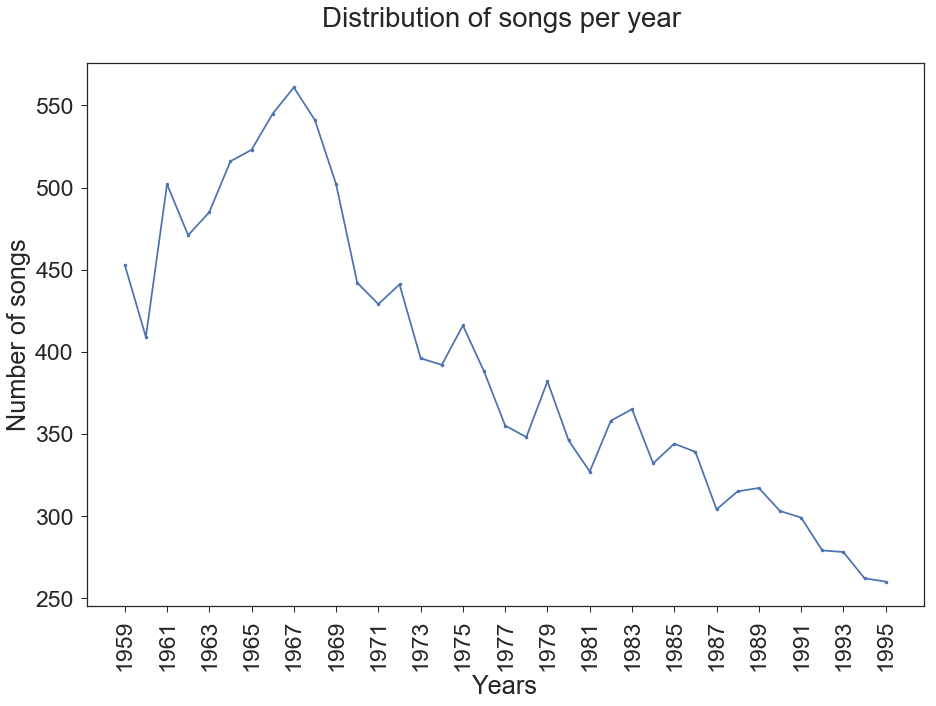
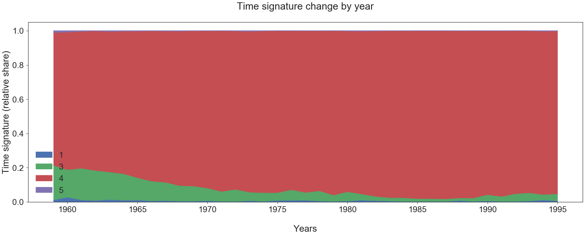
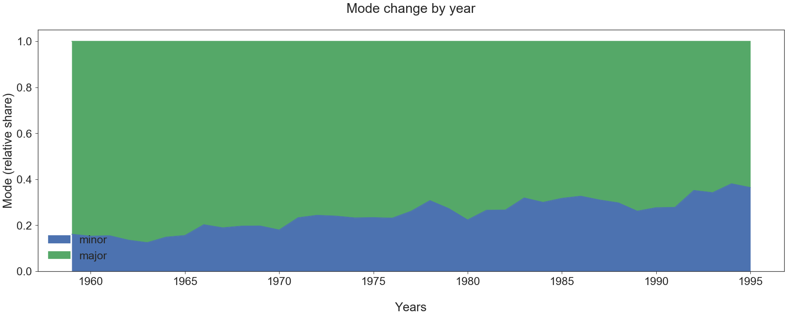
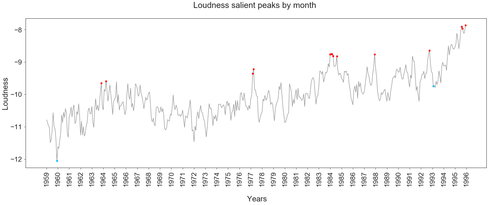
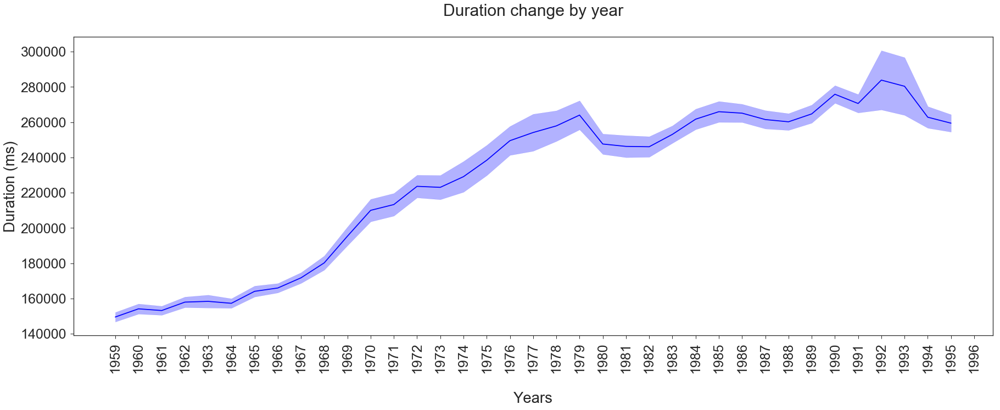
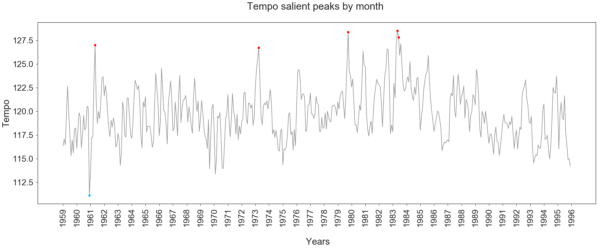

### Digital Musicology
# Understanding the impact of the Cold War on Billboard Charts:  _When the American society reflects on music creation_

## Introduction
The Cold War period, whose years from 1958 to 1995 will be analysed in the present project, saw the rise of many major and diverse cultural movements. This flourishing time also enabled a large increase in the diversity of musical genres. Regarding these prompt changes and the socio-economico-political climate, we would like to understand how major genres evolved over time and try to determine, in a second phase of the project, the possible correlations with concomitant historical events. In order to conduct the research, we worked with the Billboard Charts that provides the weekly top 100 listened musical pieces in the United States. The ranking of the Billboard is based on physical and digital sales, radio play, and online streaming in the United States.

## Research Question and Hypothesis

Our main research question is to understand the evolution of music from 1958 to 1995 and how this evolution have been impacted by contemporary events. As the music is composed of different musical genres, a second part of the question research is about how can the change observed in these genres be linked to the historical context. What is the plausibility of theses relationships ? Which humans groups are the most affected by theses events and which genres are related to them ? 
Regarding our main research question, we developed three main hypothesis that will have to be tested throughout the conduct of the project:

1. With regard to the second part of the research question, we seek to observe significant change related to the African American civil rights movement, which could be expressed e.g. in the soul genre. We also expect significant historic musical events related to the counterculture movement, such as Woodstock Musical Festival in 1969, to impact music at a long-term, especially rock and folk.

2. In general, we also expect to see divergent developments between the different genres (pop, rock, hip hop, etc). However, as the number of different genres increases through the year, many of these genres can be classified as subparts of the major genres, e.g. bubble gum pop is a subcategory of the pop genre. Knowing this, we assume that the difference for the chosen features is minimal between genres belonging to the same major genre.

3. Based on the 6 following features, we expect to see significant variation in a set of major genres:
    * **key**: no specific hypothesis was determined regarding this feature.
    * **loudness**: it corresponds to the overall loudness of a track in decibels (dB). Our hypothesis would be to see an increase of loudness in rock-related genres musical pieces.
    * **duration**:  hypothesis is that the duration of musical pieces may tend to be shorter, regarding the growing stressful context.
    * **time_signature**: our hypothesis is that, regarding the experimental artistic contexts, some new time signatures might arise. However there should be a high convergence to a 4/4 time signature.
    * **tempo**: our major hypothesis regarding this aspect is that musical pieces tend to have a faster tempo, regarding the stressful context for the US civil society (according to literature, an increase up to 120-125 beats per minute).
    * **mode**: according to what has been presented in class, we expect an increasing equilibrium between the repartition of major and minor modalities within musical pieces.

## Dataset

### Data gathering and description of the dataset
The research is based on two datasets. The first dataset is composed of the Billboard weekly list (Billboard Top 100), between  1955 and 2017, found on the online platform [Kaggle](https://www.kaggle.com/), in csv format. This table contains 300'600 rows and eight columns, containing respectively the date of the week, the rank, the song title, the artist name, the number of weeks on charts, the musical piece's year of release, the track's popularity on Spotify and the artist popularity on Spotify. The rows between 1955 and 1958 are duplicated and low-quality data. By a brief visual evaluation of the data, it can be seen that the data concerning the Spotify database are mostly missing. The number of weeks on charts is also often false or missing.

Based on song titles and artist names from this first dataset, a query is made to the [Spotify API](https://developer.spotify.com/documentation/web-api/quick-start/) in order to retrieve the corresponding entry in the Spotify database. This requires registering with Spotify as a developer and obtaining a token to access the database. The API returns json-formatted answers. The completion of the dataset is then done in several steps. The first step is to find the corresponding identifier of each track in the Spotify database, based on the artist's name and the song title. During this first run, 69% of matches were found. In a second step, this rate is increased to 78% by isolating the main artist's name and the main tokens of the title and thus submitting a simplified request to the API.

Then, the identifier obtained for each track allows access to the track features contained in the database (danceability, energy, key, loudness, mode, speechiness, acousticness, instrumentalness, liveness, valence, duration, time_signature). The track audio features (tempo, mode) are also collected in a third query. Finally, a fourth query gathers the musical genre of the artists.

### Preprocessing
Data from multiple queries were merged into a single dataset. Subsequently, the billboard data was aggregated with the API data to obtain a usable dataset containing: the titles of the two databases (Billboard and Spotify), the artist name of the two databases (Billboard and Spotify), the identifier in the Spotify database, the tracks features, the audio features, a vector of the dates of each week when the track was present in the billboard chart, and a vector including the successive ranks in the billboard chart. Finally, the highest rank in the ranking is also recovered and stored. The column containing the number of weeks spent on the chart, which was of poor quality, as indicated above, was removed. It can moreover be retrieved easily for the weeks list. For reasons of data density and quality, data prior to the first week of 1959 are not retained. This final preprocessed dataset is stored in json format, which unlike csv is able to deal the vector type.

The data have two biases. The first is the fact that "only" 78% of them could be retrieved from the Spotify database. However, this seems relatively acceptable bias, all the more so if we adopt the standpoint that the musical pieces that are still available today and that have been digitized are the most representative of their period. Moreover, in the timeframe finally selected, this percentage reaches 91%. The second bias is related to the margin of error of Echonest algorithms when determining features.

### Corpus selection
For reasons of data density and to be limited to the historical period covered by the research, only the rankings published between 1 January 1959 and 31 December 1995 have been kept in the corpus. The period extends after the end of the Cold War (until 1995) in order to see if post-Cold War changes in the political context may have influenced the music creation.

### Features
To address the research hypotheses, we started by selecting the variables. When the algorithm used by Spotify to calculate a certain variable was unknown and the definition of this variable was not commonly accepted by the majority of the scientific community, we decided not to keep it for our research. Therefore, we decided to retain only six physical variables: the duration, the time signature, the tempo, the mode, the key, and the loudness, as well as two perceptual variables (i.e. issued from psychological inquiry and then extended with a machine learning algorithm): the energy and the valence. Energy is described by Spotify as a perceptual measure of intensity and activity, and energetic tracks feel fast, loud, and noisy. Valence is described by Spotify as musical positiveness conveyed by a track. Tracks with high valence will sound more positive, while tracks with low valence will sound more negative.

### Description of the corpus
Finally, the corpus contains a total of 19,098 pieces of music representing 177,700 Billboard entries out of the 195,100 published over this period, i.e. 91%.

As we can see, most musical pieces are staying less that 20 weeks on chart, with a maximum lifespan of 42. However, thanks to the logarithmic scale, one can see that several orders of magnitude separate the number of musics that remain less than 18 weeks from those that remain more than 28 weeks on the chart. This means that beyond 18 weeks, the probability of a song remaining in the ranking drops sharply. Before this threshold, the probability of maintaining itself decreases linearly, which virtually corresponds to a plateau in this distribution curve.

Hereover, a table containing the continuous features' statistics. The perceptual variables (energy and valence) are scored on a scale without unit from 0 to 1, slightly biased upwards, but well distributed. The average duration of the songs is about three and a half minutes, with a high variance.  Tempo is measured in beat per minute (bpm), with an average of two beats per second. Loudness is measured in dB. It should be remembered that this scale is logarithmic, and that the variance is therefore greater than it seems.

One can observe that C is the most used root, followed by G, which is consistent with what we have seen in lectures. The diatonic scale is more used with the exception of B, which is a little less used that C#. Concerning the modality, 58% of the entries are classified as major, 18% as minor and 24% are not classified. For the time signature, 70% of the data are 4/4, 6% are 3/4, 0.6% are considered other (5:4 or 1:4) and 23.4% are not classified.

In this plot, one can observe the first occurrence of the songs per year. As the years go by, the number of unique songs entering in the top 100 diminishes, which corresponds to a canonization of top musics in a year.

One can observe that the physical variables (mode, time_signature, tempo, loudness, and duration) are only weakly correlated. The perceptual variables (energy and valence) are correlated with each other and to some of the physical variables. This is not surprising since both are covering similar perceptions of music. Energy explains the subject's perceptual sense of energy, while valence quantifies the subject's perceived positive feeling of the music. Therefore, the high correlation of energy with loudness is also intuitively expected. An interesting correlation to note is also that of energy and valence with time signature.

In total, there are 987 different musical genres and 4961 songs do not have a given genre (either empty or nan value). Following is an excerpt of the first mostly assigned genres names.

## Initial Analysis

### Methodology 

#### 1. Features evolution
To observe the evolution of the different features over time, annual granularity is preferred. As it allows to observe trends clearly and limit noise. The 95% confidence interval is also represented, so that trends can be visually identified. Categorical variables are represented according to their share in the total number of observations. 

In a second step, the salient peaks are mathematically identified and extracted. To detect salient peaks, the annual evolution of each feature is smoothed by convolution with a 5-year uniform smoothing filter. A symmetric 2-year replication padding is carried out to avoid shrinking. The replication padding simply consists in replicating the values of the first year to the two years before the start of the data, respectively replicating the values of the last year to the two years after the end of the data. Then, the 95% interval of this representation of this smoothed annual evolution is calculated. The lower and upper bounds of this range contain non-salient observations of the distribution, while observations outside are considered salient. This procedure allows to highlight salient peaks beyond the medium-term evolution of the music, the latter being already visible in the other graphs. To also include the variations of the categorical variables, the latter are represented as integers. Finally, the salient peaks of the different features are gathered in a single list so that they can represent and observe the concomitant salient peaks. 

#### 2. Musical genres
Due to the large amount of different genres, we decided to group them into more global categories. This was done based on the categorisation provided by the online database AllMusic and made easily retrievable by Wikipedia on their webpage <a href="https://en.wikipedia.org/wiki/List_of_music_styles"> List of music styles </a>. Hence, the content of the html page was extracted in order to list all genres and their corresponding subgenres into a json file <a href="https://github.com/ValentineCmoi/digital_musicology/blob/master/json/music_genres_classification.json"> music_genre_classification</a>. It was then used to assign for each subgenre of each song a main genre. When no corresponding main genre could be found, the name 'other' was attributed. Regarding this 'other' entry, it is important to understand that some genres, such as main genres listed above that corresponds to '**adult standards**', '**christmas**', '**motown**', '**mellow gold**' are not genres per se but rather categories that can group many different genres. Indeed, '**adult standards**' groups musical pieces that might be more attractive to an older audience (50 years old and above). Same applies with the '**christmas**' category, which groups songs that refer to Christmas, and '**mellow gold**', which seems to have been invented by Spotify to group classic rock of the ‘60s, ‘70s, and ‘80s.

### Results

#### 1. Features evolution
##### 1.1 Global changes

###### 1.1.1 Root change

One can see a dominance of the C and G tonics throughout the studied time range. However, C seems to slowly decreases in the early 90s, in favor of the C#. Others dominant roots that seem to grow over the years and compete with the two firsts in the late 70s and early 80 are D and A. The use of other roots is rather constant, with a slight increase in the use of F# in the mid 90s, whereas D# seems to vanish a bit from common usage at that same time. 

###### 1.1.2 Time signature

In terms of time signature, it is important to acknowledge that, according to Spotify, the data represents "an estimaged overall time signature of a track. [...] The time signature ranges from 3 to 7 indicating time signatures of "3/4", to "7/4""<a href="https://developer.spotify.com/documentation/web-api/reference/tracks/get-audio-analysis/">2018, Spotify</a>. The presence of a time signature of 1/4 is therefore an unexpected intruder and possible explanations are discussed below. However one should note the largely leading use of 4/4 during the studied period, which even seems to expand at the expense of the other types of time signatures. Hence, the 5/4 time signature seems to vanish. The 3/4 time, which was still benefiting from a better percentage share in the early years studied, namely around the 60s, slowly decreases and seems to reach its lower peak around the mid 80s.

###### 1.1.3 Mode

Throughout the studied period, one can see a leading majority in the use of major modes. However, the use of minor modes slowly increases over the years and benefits from a better percentage share at the end of the given time range, going from less than 20% of use in 1959 to almost 40% in 1995.

###### 1.1.4 Loudness

The first graph clearly shows an augmentation of the overall loudness of musical pieces. Relatively to the range of value that this feature can take, from -60dB to 0dB, this might not seem such a big increase as it goes from -11,5dB to -8dB. However, one should recall that the dB scale is logarithmic. The periods where the increase was the bigger were from 1972 to 1984 and since 1993.

The second graph shows three major events where a positive change appears in comparison to the general trend of the loudness. The first two events occur in March-April 1977 and from January to April and August 1984. The last event takes place during August, September and December of year 1995, but as it occurs at the end of the graph, this could just be an effect of how the padding was made to compute the salient peaks, and then not be relevant

###### 1.1.5 Duration

The first graph clearly shows an increase of the duration of musical pieces through time. From 1959 to 1964, the increase is really small et not really significant. However from year 1964 and until year 1979, there is a significant increase of duration of musical pieces as it goes from 1550000 ms (around 2,5 minutes) to 265000 ms (more than 4,5 minutes). After that, there is a small decrease where the duration is closer to 240000 ms (4 minutes), followed by a small increase that leads again the duration to around 4,5 minutes.

The second graph shows that two major events have happened. The first one occurred during the months of January and March to May 1964, where there is a negative change in comparison to the general trend, which was more to the increase when here there is a decrease of duration. The second one is in February-March 1990, where there is a positive change in comparison to the general trend. There is possibly of a third event in 1995, but as the graph ends in 1996, this is probably only an effect due to the padding.

###### 1.1.6 Tempo

The first graph shows that there is not really a difference in tempo through the years, the changes that appear are not significant because of the confidence interval.

No significant event can be observed in the tempo salient peaks figure.

###### 1.1.7 Energy

The energy tends to rise slowly during the whole period, in four consequent steps. A first significant step occurs between 1962 and 1964. The second step, in 1970, appears to be driven by a salient event in June-July 1970. The third step takes place between 1973 and 1974 and the fourth and last step occurs between 1982 and 1984 and is preceded by a low-bound event which begins in September 1981 and ends in January 1982.

###### 1.1.8 Valence

The valence seems to be relatively stable until 1987. It falls significantly and durably at the end of the Cold War. This decrease is progressive rather than sudden but consequent though. 

One can observe four major events in the valence salient peaks figure. The first occurs in July-August 1976, the second in November-December 1977, the third spread from March to August 1979 and the last event takes places between September 1981 to January 1982. These events occur in the form of up-and-down cyclic events. The two last peaks are clearly visible also at year granularity. 

##### 1.2 Salient peaks

This graph represents the sum of the salient peaks, i.e. the projection of all salient peaks in a single plot, month by month, for each of the eight features. Denser regions represent periods when many salient peaks have occurred concurrently, while higher peaks represent a cross-sectional impact on several features at the same time. The pink highlights represent the major events, defined as a suite or a stack of at least 3 events within a three-month period. 

#### 2. Musical genres
The distribution of genres was plotted using heatmaps:

Because of the dominance of the 'other' category, which makes it hard to perceive the distribution of other main genres, it was decided to remove it from following heatmap. Indeed, the 'other' category encompass non-musical genre classifications, such as '**adult standards**', '**christmas**' or '**mellow gold**', as well as all **_None_** attributed titles. The removal of 'other' should hence not affect the results but provides more visibility.

As we can see on these two heatmaps, there is a prevalence of rock musical pieces between 1964 and 1990. Country music saw a decrease of popularity throughout the 70s and hip hop songs appeared later, with early uses in 1964 and 1969 before settling down in the late 70s. In order to better understand these movements of music genres, a similar heatmap with a normalized distribution for each genre was created:

On the above, we can clearly see that hip hop seems to have reached its pick of use for the studied time range in the early 90s, similarly to Caribbean and Caribbean-influenced songs. Other music genres benefit from a more linear distribution over time.

A third heatmap with a normalized distribution per year was finally produced in order to better see the dominance of some genres for each year.

#### 3. Clustering

### Interpretation

#### 1. Features evolution
##### 1.1 Global changes
As we have seen from the results of the [root changes](https://github.com/ValentineCmoi/digital_musicology/blob/master/milestone3.md#111-root-change), there is a certain homogeneity in-between the different keys used and the traditional use of C seems to decrease a bit toward the end of the studied period. A possible interpretation would be the fact that the end of the 21st Century was at the heart of musical explorations, which pairs with the arrival of new musical genres. Indeed, the last half of the Century saw the emergence of rock, pop or hip hop, just to name a few. This emergence is probably accompanied by a slight shift in the conventional musical instruments used, such as the guitar for rock songs.  Hence, a possible explanation of this small modulation of root used would be that composers had to find solutions in order to better suit the majority of instruments used. 

Regarding these results and the comparison with musical genres, it is interesting to see from <a href= “https://insights.spotify.com/int/2017/10/03/genres-and-key-signatures/”>Spotify insight</a> the different key signatures of each style. From their work, we can see that Rock music tends to use both C and D followed by G, which explains the similar repartition of these three roots in our plot, since it seems that the genre is leading the Billboard chart in greater parts of our studied period.

In terms of [time signature](https://github.com/ValentineCmoi/digital_musicology/blob/master/milestone3.md#112-time-signature), the 4/4 time is the most commonly used type in western music, and the latter is greatly showed by the obtained results. The use of 4/4 allows more time to produce notes in-between each measure, whereas the 3/4 time is much more restricted and marked as a Waltz. Another interpretation is also the fact that there is a great emergence of rock throughout these years, as well as pop, country and blues at the early stages of the studied period, which all use a majority of 4/4.
Regarding the apparition of a 1/4 time in the data, no explanation, other than the fact that it might have been an experimental time signature, was found regarding this point. Indeed, in theory, the 1/4 time exists, as it would consist of one single beat in a measure, but it is very unlikely that a composition would have used in a dominant way such a time signature.

The results regarding the [different modes](https://github.com/ValentineCmoi/digital_musicology/blob/master/milestone3.md#113-mode) used can be addressed with respect to their affective quality. Indeed, previous <a href="https://www.jstor.org/stable/1416710?casa_token=BwZlFn70tigAAAAA:BBdwfU8J62HJlOxtoYbNibrotbpnr47ZDMI-ynZ8XFavGZseefEZT5-UN-H61DuRZKBIUB6H6L6PS1oLw9tGahhXF70tgVY22ZDo8R-07_bkVPMWQ9TB&seq=1#metadata_info_tab_contents">researches</a> have shown that major is usually felt as being more dynamic, bright, happy and more natural and fundamental than the minor. The latter would convey a darker or more depressive emotion. Hence, the slight increase of minor mode toward the end of the studied period of times can be put in correlation with the observed valence value that significantly decreases in the early 90s. These results would then mean that people at the end of the 21st Century tended to listen music that somehow sounded more sad, whereas the American population of the 60s was looking for more joyful music. This shift in emotion conveyed by songs can have many different interpretations, one being the change in the way people consume music. More research will have to be done toward that direction, but one could imagine that people were for example dancing more in the 60s and 70s and using music for that purpose, whereas in the 90s, with the arrival of new technologies such as the Walkman, the purpose of music consumption changed and became more of a personal experience with people were looking maybe for stronger feelings transmissions.

The result regarding [the increase of the loudness](https://github.com/ValentineCmoi/digital_musicology/blob/master/milestone3.md#114-loudness) in musical pieces can be partly explain by a phenomenon called the loudness war. The main idea of this phenomenon is that louder songs catch more the attention than the quieter ones, and it started to appear in music from 1960s, but became more present with the apparition of the CD in the 1980s.Thanks to digital audio formats, loudness became easier to manipulate and to increase on musical pieces. This phenomenon could explain why the increase in loudness got stronger since 1979 in musical pieces present in the Billboard Chart, as this practice of intensifying loudness became more common in music production.

Concerning the result about [duration of musical pieces](https://github.com/ValentineCmoi/digital_musicology/blob/master/milestone3.md#115-duration), the fact that there is a constant increase contradicts our initial hypothesis.The fact that musical pieces were no longer that 3 minutes until 1968 can be explained by the fact that at this time, songs were passed on the radio only if they were on 45 rpm single, which can only record 3 minutes of music. As we can suppose that artists wanted to have their musical pieces played on the radio, they adapted their length. It is hard to tell why there was an increase of duration from 1968 to 1985 (when the CDs were popularized), because the radio was still using 45 rpm singles. One hypothesis could be that as the Billboard Chart is based on physical sales and radio play people bought songs that were longer than the ones passed on the radio and that these sales influenced the chart. Another hypothesis could be that the emergence of electronic music (since 1968) had a role in the increase of duration. Since the musical pieces of this genre are mostly made in order for people to dance when listening to them, the songs could be longer as people might like to dance more than 3 minutes.

Regarding the result in [the variation of tempo](https://github.com/ValentineCmoi/digital_musicology/blob/master/milestone3.md#116-tempo), an explanation about the absence of significant change can be that the tempo is related to the genre of the musical pieces. For each genre, there is a range of tempo that is commonly attributed to it. So, if there is a change, one must look at the variation of tempo for each different genre through years and not the tempo for all genres at once.

As explained in the introduction, valence is a perceptual variable describing the subjective positive vibe of the music. One can note that [the drop of the valence](https://github.com/ValentineCmoi/digital_musicology/blob/master/milestone3.md#118-valence), at the end of the Cold War, is concomitant with the fall of rock and pop. Both represent a significant part of the corpus and in appears to be a reasonable assumption to say that both may be linked to a high valence. This can be a factor of explanation of the valence drop. Another factor could be linked to the rise of the electronic music, such as techno. It was noted in the introduction that valence and energy are correlated features. On the contrary, during this period, both follow opposite paths. The techno-related music hypothesis is plausible it the sense that it might feel more energetic but not very emotional, and therefore result in a lower valence but in a higher energy.

On the other hand, the perceived [energy](https://github.com/ValentineCmoi/digital_musicology/blob/master/milestone3.md#117-energy) of music rises by nearly a third over the period. A very clear increase. This increase echoes also the increase in loudness. Both seem to be part of a broader economical-artistic trend that is reflected in many fields, <a href="https://journals.sagepub.com/doi/abs/10.1068/i0441aap">including e.g. cinema</a>. This movement is characterized by more frenetic artistic creations, always more stimulating for customers, in a creative context that addresses ever-increasing audiences.

##### 1.2 Historical interpretations

| Event number | Dates                  | Features changes                                |
|--------------|------------------------|-------------------------------------------------|
| 1            | Dec. 1959 – Feb. 1960  | low energy, low loudness                        |
| 2            | Dec. 1960 – Feb. 1961  | low energy, low tempo, root change              |
| 3            | Nov. 1963 – May 1964   | high loudness, short duration                   |
| 4            | Jul. 1974 – Sep. 1974  | more 4:4                                        |
| 5            | Mar. 1979 – Oct. 1979  | high valence, high tempo, more 4:4, root change |
| 6            | Sep. 1981 – Aug. 1982  | low valence, low energy, short duration         |
| 7            | May. 1983 – Jul. 1983  | high tempo, more 4:4                            |
| 8            | Jan. 1984 – Apr. 1984  | high loudness                                   |
| 9            | Apr. 1987 – Jun. 1987  | more 4:4                                        |
| 10           | Oct. 1989 – Mar. 1990  | long duration, more 4:4                         |

The above table is a summary of matching dates and feature changes. However, it seems difficult to find direct events that could have impacted these changes. In terms of music styles, from a brief overview one can easily see the gentle decrease of popularity of country music, which is strongly related to the American culture. This decrease gradually let place to rock, which can be understood as an opening to international culture, as this genre find great influences and production centers in Europe as well. This ‘internalization’ of musical culture might find its roots in the rising globalisation phenomenon that is a direct effect of arising diffusion tools, such as television. Further research could thus be conducted toward this phenomenon in order to better understand the evolution of musical trends. Indeed, it seems from a first approach quite difficult to link specific historical events with feature changes that occurred in the studied period of time. Another approach would be to apprehend these changes more globally and understand the evolution of a society not only from a perspective of specific social events that might have taken place, but also it terms of technical progress and changes that transformed the everyday life of citizens and the way population changed its consumption of music and cultural products.

#### 2. Musical genres

With the different heatmaps generated, we can clearly see a dominance of rock music from the mid-60s to the early 90s. Before the rise of rock music, country music seems to have been more dominant. One can also see that musical genres, such as hip hop, Caribbean and electronic appeared later on the musical scene. 

The fact that there is a greater proportion of songs listed as 'other', especially at the beginning of the studied period, in the early 60s, is explained by the fact that these years are nowadays considered as _nostalgic_ years. 'other' thus includes categories such as '**adult standards**', '**christmas**' or '**mellow gold**', which are not musical genres but groupings of a variety of musical genres based on subjective criteria. 'other' also includes all **_None_** attributed titles, as explained previously. 

However, another explanation of the prevalence of 'other' at the specific given period could be the fact that these early years were the laboratory of diverse research and novelties in terms of musical genres and that many of them were not retained by history, despite the popularity of one song at some point.

In a general way, this first set of results shows the great emergence of different musical styles over the studied period. The fact that we had to group the large amount of genres to more general classes and that this evolution is still perceivable is an interesting proof of that phenomenon. The great majority of top listed titles from which rock music benefits shows not only its popularity, but is also a hint of the diversity of subgenres that occurred within this style.

## Discussion 
### Arising Difficulties

A major difficulty encountered was the diversity of genres. It was a discovery at first, because such a variety was not expected. We then had to find a suitable classification in order to group these categories. Many music styles classifications exist and can depend on the year such classifications were created and the prevalence of specific music styles. However, big classes, such as '**Rock**', '**Pop**', '**Blues**' and '**Jazz**' seem to be common to most of them. We finally chose a classification that could both show the emergence of new styles and would show the diversity of styles presented in the USA, at the years of our dataset. We then had to find an easily retrievable classification with corresponding subgenres. In the end, the music style classification from AllMusic, made available by Wikipedia, was chosen. It corresponds the following classification:
'**blues**', '**caribbean and caribbean-influenced**', '**r&b and soul**', '**rock**', '**country**', '**electronic music**', '**folk**', '**hip hop**', '**jazz**', '**latin**', '**pop**'.

### Interesting Problems

One of our most unexpected result was the tempo. Indeed, our hypothesis (see Research Question and Hypothesis) was that musical pieces tend to have a faster tempo over the years, regarding the stressful context for the US civil society. As explained in the Results and Interpretation sections, we discovered, with the resulting graph of the representation of tempo through the studied period of time, that tempo does not change significantly. However, as this graph represents the aggregation of all genres, it would be interesting to conduct further research to see if a change could be perceived for specific musical genres.

### Next steps towards the final analysis

Further research will have to be done in terms of feature changes for each of the main genres. Such information might help better understanding how different musical communities evolved over years and if they could be more easily put in correlation with historical events or cultural changes. 

Regarding the historical interpretation of these results, more research will have to be done to find appropriate big social changes or political decisions that could have had an impact on feature changes. Other paths, such as a broader analyze of shifts in cultural products consumption due to new technologies and globalization could be considered, as discussed in the interpretation of the results.

A last step would be to perform machine learning on the dataset in order to better perceive the correlation between the features and their corresponding genre. A first approach would be to perform a Fisher LDA in order to see characteristic features of a genre. A second one would be a reverse engineering approach. The latter would consist in performing an unsupervised clustering of the data, such as Mean Shift clustering, in order to see if some of the genres can naturally emerge from the musical features, and to observe the way in which genres are interwoven.

## Literature
- Karen A. Cerula, "Social Disruption and Its Effects on Music: An Empirical Analysis", _Social Forces_, Vol. 62, Issue 4, June 1984, pp. 885-904, [Accessed on: <a href= https://doi.org/10.1093/sf/62.4.885> https://doi.org/10.1093/sf/62.4.885</a>]
- Richard A. Peterson and David G. Berger, "Cycles in Symbol Production: The Case of Popular Music", _American Sociological Review_, Vol. 40, No. 2, April 1975, pp. 158-173,  [Accessed on: <a href= https://www.jstor.org/stable/2094343> https://www.jstor.org/stable/2094343</a>]
-  Eric Clarke, Nicholas Cook, "Empirical Musicology: Aims, Methods, Prospects", Oxford University Press, 2004
- Timorhty J. Dowd, "Production perspectives in the sociology of music", _Poetics_, Vol. 32, Issue 3-4, pp. 235-246,  [Accessed on: <a href= https://doi.org/10.1016/j.poetic.2004.05.005> https://doi.org/10.1016/j.poetic.2004.05.005</a>]
- Peter J. Schmelz, "Introduction: Music in the Cold War", _The Journal of Musicology_, Vol. 26, No. 1, 2009, pp. 3-16 [Accessed on: <a href= https://www.jstor.org/stable/10.1525/jm.2009.26.1.3> https://www.jstor.org/stable/10.1525/jm.2009.26.1.3</a>]
- Matthias Mauch, Robert M. MacCallum, Mark Levy, and Armand M. Leroi, "The Evolution of Popular Music: USA 1960-2010", _Royal Society Open Science_, Vol. 2, No. 5, May 2015, [Accessed on: <a href= https://doi.org/10.1098/rsos.150081> https://doi.org/10.1098/rsos.150081</a>]
- Hevner, K. (1935). "The Affective Character of the Major and Minor Modes in Music". The American Journal of Psychology, 47(1), 103-118. www.jstor.org/stable/1416710
- Kenny Ning, Eric Humphrey, Eliot Van Buskirk, "Genres in the Key of Life: Different Music Uses Different Scales", October 2017, https://insights.spotify.com/int/2017/10/03/genres-and-key-signatures/
- Eliot Van Buskirk, "The Most Popular Keys of All Music on Spotify", May 2015, https://insights.spotify.com/us/2015/05/06/most-popular-keys-on-spotify/
- James E Cutting, Kaitlin L Brunick,  Jordan E DeLong, & others, "Quicker, Faster, Darker: Changes in Hollywood Film over 75 Years", _i-Perception_, Vol 2, Issue 6, pp.569-576, January 2011, [Accessed on: <a href= https://doi.org/10.1068/i0441aap> https://doi.org/10.1068/i0441aap</a>]
- Kyle Devine, "Imperfect Sound Forever: Loudness Wars, Listening Formations and the History of Sound Reproduction", Popular Music, 32(2), 2013, pp. 159-176, [Accessed on: <a href= https://doi.org/10.1017/S0261143013000032> 
https://doi.org/10.1017/S0261143013000032</a>]

It seems that a great work was conducted during the 70s and 80s in order to understand the social significance of music and its relationship to sociological events. Indeed, the Cold War saw the emergence of major popular cultural movements. Many artistic fields, starting by art historians, were trying to understand the impact and influences of the political situation. More recently, in 2006, the <a href= http://ams-net.org/cwmsg/>AMS Cold War and Music Study Group</a> was created by the American Musicological Society in order to understand the impact of this important event on the field. However, most of these empirical studies were focusing on lyrics and genres of music, on the predominance of certain musicians on the market and on the impact of leading recording companies in the music industry. It seems that no direct analysis of the technical music properties, such as harmony, keys or tempo, and their evolution through the years was put in relationship to the sociological context. The idea would be to go as well from the performing social context to the music generated, but to determine the structural impact rather than the style or genre evolutions.
